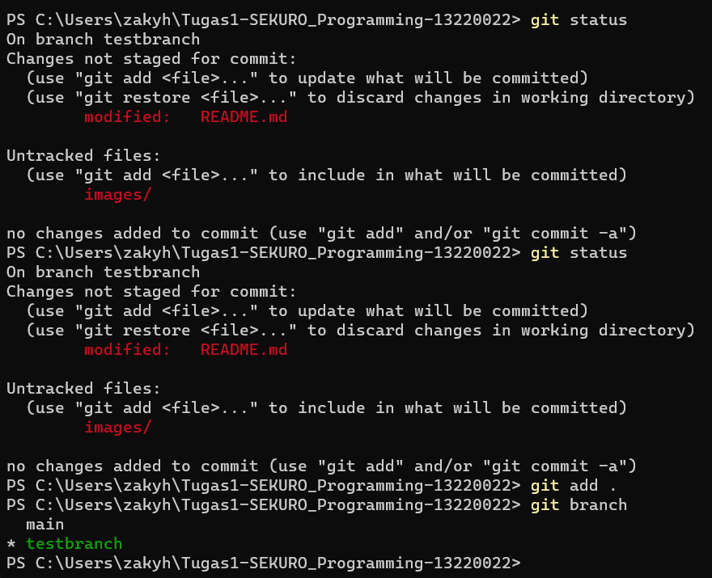
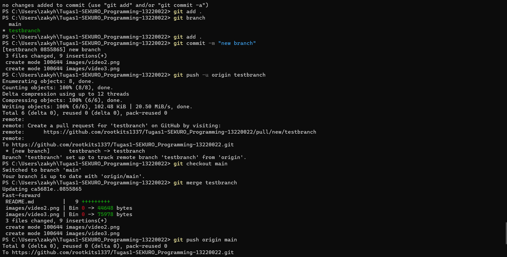
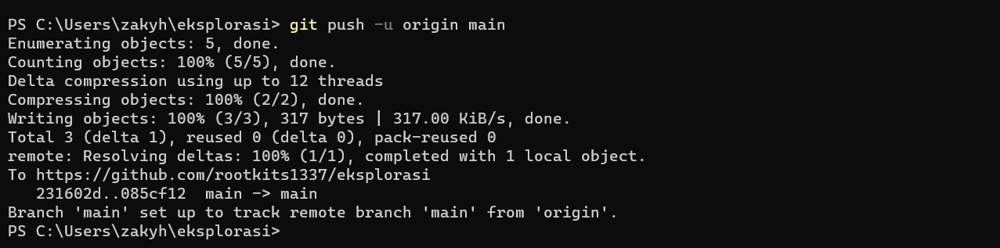
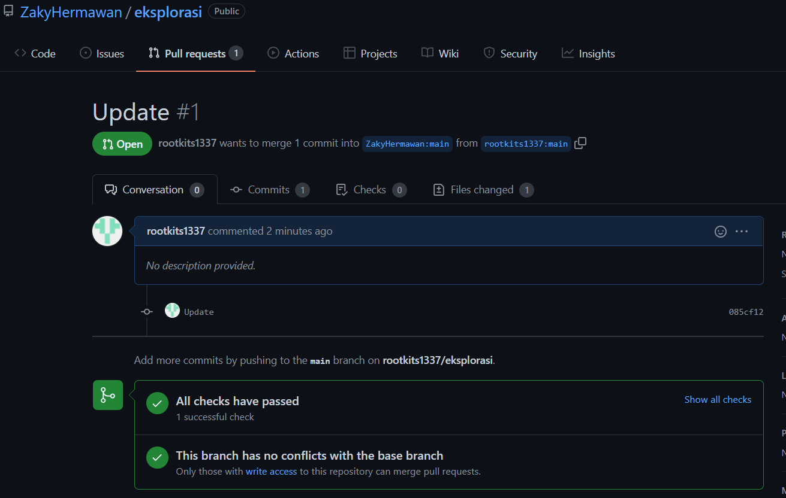
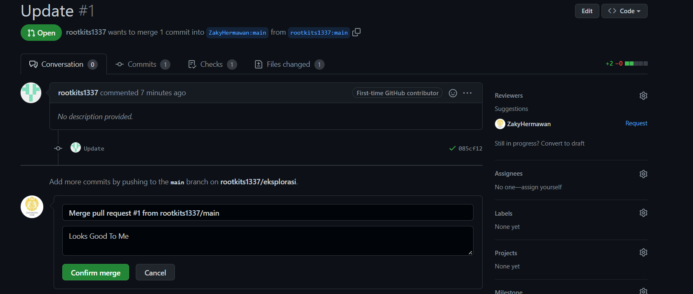

# Tugas1-SEKURO_Programming-13220022

Video 1: Git merupakan version control system di mana kita dapat memanage dan melacak history dari source code yang kita buat. Github merupakan tempat kita dapat mengupload source code yang kita buat

Video2: Pada video ini diajarkan cara membuat akun github, membuat repository, dan menulis file di github langsung
Mengubah README.md

Video3: Pada video ini diajarkan mengenai branch pada git, di mana kita dapat membuat branch baru sehingga tidak mengganggu branch main, lalu kita dapat melakukan merging dari satu branch ke branch lain
Membuat branch baru

Push merge dan push perubahan dari branch baru

Video4: Menjelasakan mengenai forking pada git, serta melakukan pull request, di mana kita dapat berkontribusi pada kode yang ditulis orang lain
Push perubahan terbaru pada forked repository

Membuat pull request

Merge pull request

Video5: Menjelaskan cara bekerja dengan git, jadi kita dapat mengupload dan edit source code ke github via git

