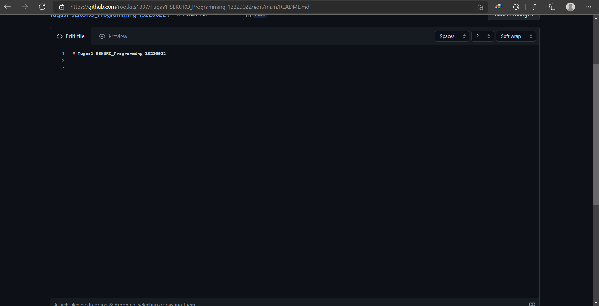

# Tugas1-SEKURO_Programming-13220022

Video 1: Git merupakan version control system di mana kita dapat memanage dan melacak history dari source code yang kita buat. Github merupakan tempat kita dapat mengupload source code yang kita buat

Video2: Pada video ini diajarkan cara membuat akun github, membuat repository, dan menulis file di github langsung

Video3: Pada video ini diajarkan mengenai branch pada git, di mana kita dapat membuat branch baru sehingga tidak mengganggu branch main, lalu kita dapat melakukan merging dari satu branch ke branch lain

